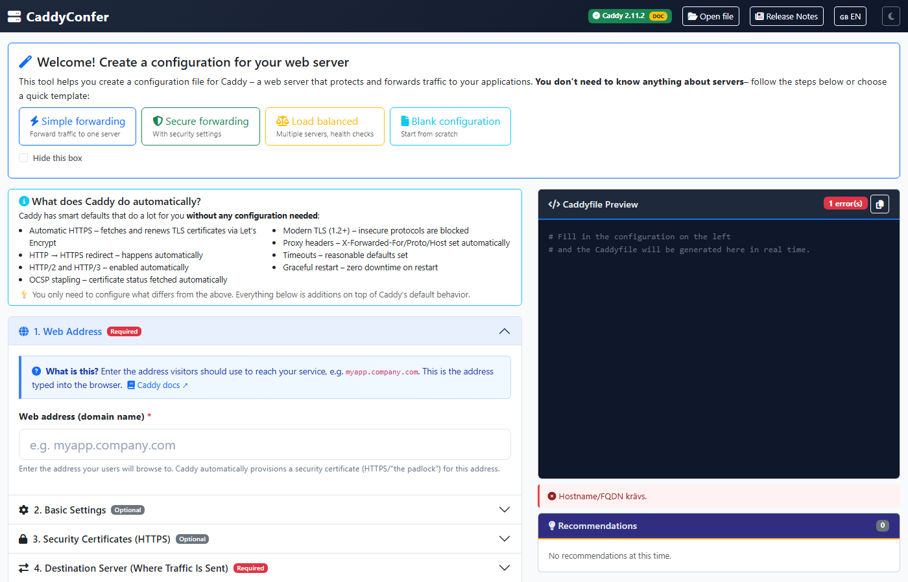

# CaddyConfer

A web-based configuration generator for [Caddy server](https://caddyserver.com/) reverse proxy configurations. Build production-ready Caddyfiles through an intuitive UI — no manual syntax required.



## Features

- **Visual Configuration** — 12 accordion sections covering every aspect of a Caddy reverse proxy
- **Live Preview** — Real-time Caddyfile generation with syntax highlighting
- **Validation & Recommendations** — Inline errors/warnings and actionable best-practice suggestions
- **TLS/Certificates** — Automatic (Let's Encrypt), ZeroSSL, ZeroSSL+LE fallback, manual cert/key, PFX, internal
- **Security Headers** — HSTS, CSP builder, Permissions-Policy, Referrer-Policy, and more with presets
- **SSH/SFTP Deployment** — Connect to remote servers, upload configs, validate with `caddy validate`, reload Caddy
- **Git Integration** — Push configuration files directly to a Git repository
- **Certificate Generation** — Create CA and client certificates (including PFX) for mTLS
- **Keycloak / Forward Auth** — SSO integration via Caddy's `forward_auth` directive
- **CORS, Redirects, Error Pages** — Full configuration for common web patterns
- **Load Balancing** — Multiple upstreams with policy selection and health checks
- **Dark Mode** — Full dark theme, persisted in browser
- **i18n** — Swedish and English with 400+ translated strings
- **Inline Documentation** — Direct links to Caddy docs for every setting
- **Config History** — Automatic versioning on every save

## Quick Start

### Requirements

- Python 3.9+ (3.11+ recommended)
- A web browser

### Install & Run

```bash
# Clone
git clone https://github.com/sayonarase/caddyconf.git
cd caddyconf

# Install dependencies
pip install -r requirements.txt

# Start
python server.py
```

Open **http://localhost:5555** in your browser.

### Linux Auto-Installer

```bash
bash install.sh
```

Supports Ubuntu/Debian, Rocky/RHEL/CentOS/Fedora. Handles dependencies, venv, systemd service, and firewall.

## Tech Stack

| Component | Technology |
|-----------|-----------|
| Backend | Python / Flask |
| Frontend | Vanilla HTML/CSS/JS + Bootstrap 5 (CDN) |
| Certificates | Python `cryptography` library |
| Password Hashing | bcrypt (14 rounds) |
| SSH/SFTP | paramiko |

## File Structure

```
caddyconf/
├── server.py              # Flask backend + API endpoints
├── requirements.txt       # Python dependencies
├── install.sh             # Linux auto-installer
├── installguide.txt       # Detailed installation guide
├── RELEASE_NOTES.md       # Version history
├── public/
│   ├── index.html         # Main SPA
│   ├── css/style.css      # Styles + dark mode
│   └── js/
│       ├── app.js             # UI logic & event handlers
│       ├── config-builder.js  # Caddyfile generator
│       ├── i18n.js            # Translations (SV/EN)
│       └── tooltips.js        # Descriptions & presets
├── configs/               # Saved .caddy files (auto-created)
└── certs/                 # Generated certificates (auto-created)
```

## Output Format

Configuration files are saved as `<FQDN>.caddy`, e.g.:

```
configs/myapp.example.com.caddy
```

## Caddy Compatibility

Built for **vanilla Caddy** (no plugins required). Version-specific features are noted in the UI. ZeroSSL+Let's Encrypt fallback requires Caddy v2.7+.

## License

This project is provided as-is for internal and personal use.
